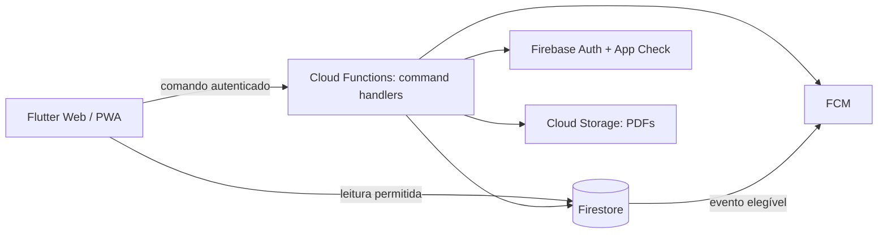
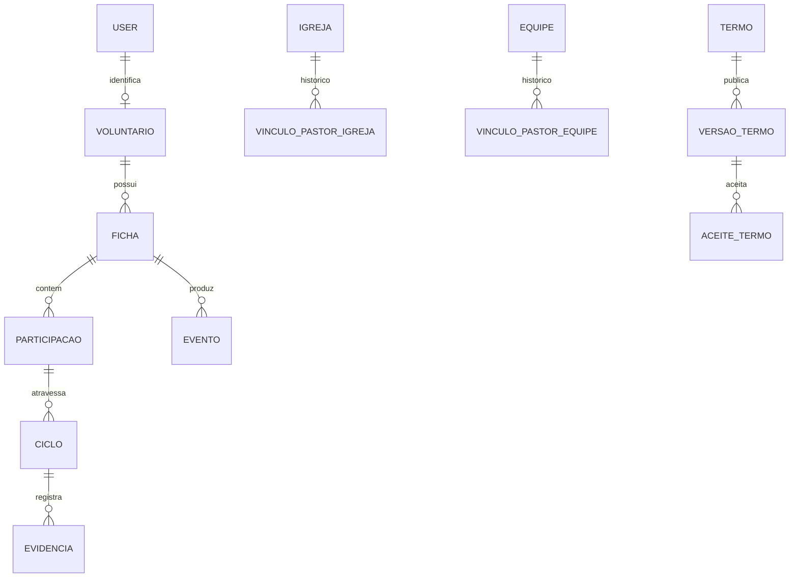

# Architecture Spine — Gestão de Voluntários do Maanaim

## Design Paradigm

**Workflow-orchestrated domain services with append-only evidence.** Flutter é cliente de apresentação; Cloud Functions são a única fronteira de mutação crítica. Cada comando valida identidade, papel, vínculo vigente, estado e pré-condições em transação; persiste o novo estado, a evidência de decisão e eventos de auditoria no mesmo compromisso lógico.



## Invariants & Rules

### AD-1 — Backend é a autoridade de mutação [ADOPTED]

- **Binds:** todos os comandos críticos.
- **Prevents:** Flutter ou Firestore Rules autorizarem, por engano, transições de negócio.
- **Rule:** envio, decisões, assinaturas, cancelamento, reativação, renovação, termos, vínculos e PDF são executados por Cloud Functions autenticadas; Rules negam escrita direta nesses recursos de domínio.

### AD-2 — Autorização contextual e temporal [ADOPTED]

- **Binds:** decisões locais, por equipe, coordenação e administração.
- **Prevents:** perfil isolado, vínculo expirado ou vínculo de outra entidade conceder autoridade.
- **Rule:** a função busca o vínculo vigente no instante da transação (`inicioVigencia <= agora < fimVigencia|aberto`), confere papel, escopo (igreja/equipe), entidade-alvo e estado. O evento grava snapshot de ator, papel e vínculo usados.

### AD-3 — Um pastor local vigente por igreja

- **Binds:** gestão `pastorIgreja` e roteamento de pendências locais.
- **Prevents:** dois responsáveis simultâneos ou lacuna causada por concorrência.
- **Rule:** criar/substituir/encerrar vínculo ocorre em transação sobre o documento canônico da igreja e vínculo; a transação recusa sobreposição temporal. Pendências sem decisão são resolvidas pelo vínculo vigente na hora de agir, nunca por um `pastorId` congelado na fila.

**Extensão para equipes:** cada equipe possui um único responsável canônico vigente por vez **[ADOPTED]**. `pastorEquipe` usa a mesma vigência semiaberta UTC e transação sobre o documento canônico da equipe; pendência sem decisão é atribuída ao responsável vigente na ação. Trocas têm data efetiva não retroativa para pendências já decididas.

### AD-4 — Ficha permanente, participação e ciclo são entidades distintas [ADOPTED]

- **Binds:** cadastro, nova equipe, cancelamento parcial, renovação e relatórios.
- **Prevents:** uma rejeição/cancelamento de equipe alterar outras equipes ou apagar histórico.
- **Rule:** `ficha` identifica o voluntário e mantém seu histórico; cada `participacao` aponta uma equipe; cada `ciclo` (inicial ou anual) tem decisões e resultado próprios. O resumo atual é derivado/transacional, nunca substitui registros de ciclos anteriores.

### AD-5 — Máquina de estados comandada no servidor

- **Binds:** ficha, participação e ciclo.
- **Prevents:** saltos de estado, dupla aprovação e reexecução de comando.
- **Rule:** comandos recebem `expectedVersion`/estado esperado e executam transação. Transições permitidas ficam em módulo único, testado: ficha `RASCUNHO → AGUARDANDO_PASTOR_LOCAL → AGUARDANDO_EQUIPES → AGUARDANDO_COORDENADOR → ATIVA`; participações/ciclos avançam independentemente. Rejeição parcial deixa as demais aptas. A tabela canônica abaixo também é a especificação para as stories; mudanças exigem novo AD.

### AD-6 — Aprovação é evidência imutável com assinatura autenticada [ADOPTED]

- **Binds:** termo, decisão local, decisão de equipe e decisão do coordenador.
- **Prevents:** PDF/consulta exibirem assinatura sem evento real ou decisão reescrita.
- **Rule:** cada decisão cria documento de evidência com UID, nome e papel em snapshot, vínculo, alvo, ciclo, decisão, justificativa, `serverTimestamp`, etapa e versão do termo quando aplicável. Documento de evidência não é atualizado nem excluído por clientes; PDF é projetado desses documentos.

### AD-7 — Termos e ciclos são versionados, nunca sobrescritos [ADOPTED]

- **Binds:** publicação/aceite de termo e renovação anual.
- **Prevents:** perda do texto aceito ou confusão entre aprovação inicial e anual.
- **Rule:** publicar cria versão imutável com conteúdo/snapshot; aceite referencia versão exata. A vigência de cada ciclo é de 1 ano contado a partir da aprovação final do Coordenador. Renovação cria novo ciclo com ano, janela e referências às participações escolhidas; não altera ciclos anteriores. A janela e o calendário de alertas são derivados dessa data de vencimento e permanecem configuráveis.

### AD-8 — Auditoria append-only e separada da projeção operacional [ADOPTED]

- **Binds:** todos os comandos e administração.
- **Prevents:** atualização de estado sem trilha, auditoria alterável ou auditoria incompleta em operação multi-documento.
- **Rule:** toda mutação crítica cria, na mesma transação, um recibo `commands/:commandId`, a evidência/evento do agregado e uma entrada `auditOutbox/:commandId` com correlação comum. O comando é recusado se não couber nesse orçamento transacional; um consumidor idempotente materializa `auditoria/:commandId` e projeções derivadas. Enquanto o recibo não estiver `COMPLETO`, a ação não é apresentada como concluída; reconciliação alerta e reprocessa o outbox. Eventos/evidências são somente criação por função privilegiada; incluem ator, ação, entidades, antes/depois permitidos, justificativa e metadados mínimos. Eventos não são fonte para permissões atuais.

### AD-9 — Leituras seguem projeções mínimas e Rules contextuais

- **Binds:** dashboards, filas, detalhes, relatórios e PDFs.
- **Prevents:** consulta ampla vazar dados de igrejas/equipes não vinculadas ou N+1 inviável.
- **Rule:** Firestore e Storage partem de `deny`; clientes só leem projeções nomeadas. Escritas são exclusivas das funções, exceto rascunho privado do próprio voluntário com campos permitidos. Rules não concedem acesso por um `role` gravável pelo cliente: identidade (Auth), papel (custom claims emitidas/revogadas somente por função IAM restrita) e vínculo são fontes separadas. Projeções carregam chaves de escopo (`igrejaId`, `equipeId`, `estado`, `ano`, `proximaAcao`); Rules autorizam leitura por dono, administrador/coordenador ou vínculo vigente verificável. Auditoria global, relatórios e exportações passam por função com filtros obrigatórios, paginação limitada, mascaramento por papel e evento de consulta/exportação.

### AD-10 — Idempotência, concorrência e notificações pós-compromisso

- **Binds:** comandos, substituição de responsáveis e notificações.
- **Prevents:** dupla decisão por toque/retry, estado parcial e notificação de ação não confirmada.
- **Rule:** todo comando usa `commandId` único, armazena resultado idempotente e compara versão do agregado. A transação decide; notificação é emitida apenas a partir de evento persistido e pode ser reprocessada sem modificar o domínio.

### AD-11 — Redução de estados e ciclo anual canônicos

- **Binds:** renovação, cancelamento, expiração, reativação, filas e dashboards.
- **Prevents:** ficha e participações mostrarem resumos incompatíveis ou ciclos anuais duplicados.
- **Rule:** cada `participacaoId + anoVigencia` admite no máximo um ciclo não terminal, com chave determinística e lock transacional. A ficha é `ATIVA` se possuir ao menos uma participação ativa; é `REJEITADA` se o ciclo inicial fechar sem participação aprovada; é `INATIVA` se não possuir participação ativa por decisão/encerramento; é `EXPIRADA` quando todas as participações ativas vencem sem renovação concluída. A seleção “não continuar” encerra a participação ao fim da vigência, preservando-a como `INATIVA`; “continuar” abre o ciclo anual e repete Pastor Local atual → responsável atual da equipe → Coordenador. Renovação não substitui o ciclo anterior.

| Comando | Origem autorizada | Ator | Resultado obrigatório |
|---|---|---|---|
| `cancelarParticipacao` | participação não terminal | voluntário dono, Pastor Local da igreja, responsável vigente da equipe, Coordenador | participação `CANCELADA`, ciclo terminal e evidência com motivo |
| `cancelarVoluntariado` | ficha não terminal | voluntário dono, Pastor Local vigente, Coordenador | todas as participações não terminais `CANCELADA`; ficha `CANCELADA` |
| `expirarCiclo` | vigência encerrada sem renovação concluída | job privilegiado idempotente | participação/ciclo `EXPIRADA`; redução recalcula ficha |
| `solicitarReativacao` | ficha/participação `CANCELADA`, `INATIVA` ou `EXPIRADA` | voluntário dono | cria solicitação; nenhuma participação antiga volta a ativa |
| `aprovarReativacao` | solicitação válida | mesma cadeia do fluxo inicial | cria novo ciclo inicial da participação escolhida; eventos anteriores permanecem finais |

### AD-12 — Dados pessoais, PDF e privilégio operacional

- **Binds:** ficha, auditoria, relatórios, notificações, Storage e operações administrativas.
- **Prevents:** PII excessiva em eventos, autoelevação de papel, URL pública de PDF ou apagamento privilegiado não detectado.
- **Rule:** o schema de evento permite somente IDs, ação, timestamps, estado, vínculo/papel em snapshot e motivo categorizado; nunca copia ficha completa, documentos, tokens, endereço ou dados sensíveis para auditoria, FCM, logs ou erros. PDFs ficam em bucket privado sob `pdfs/:fichaId/:documentoId`; só uma função autorizada os cria/lê, emite URL curta revogável e registra acesso/geração. Contas de serviço seguem menor privilégio; alterações administrativas, regras/IAM e deleções são monitoradas por Cloud Audit Logs e backups/exportações protegidos. Ficha, auditoria, PDFs e backups são retidos por 5 anos, salvo obrigação legal superior; a anonimização preserva IDs/eventos e remove/mascara PII nas projeções elegíveis.

### AD-13 — Termo em PDF é individual por equipe e fiel à estrutura aprovada [ADOPTED]

- **Binds:** ficha inicial, cadastro do Coordenador, geração de PDF e evidências de aprovação.
- **Prevents:** PDF genérico para várias equipes, assinaturas fora de posição/autoridade ou dados jurídicos informados pelo cliente.
- **Rule:** no primeiro preenchimento da ficha, Nome Completo, Profissão e CPF são obrigatórios. Para cada participação aprovada, a função gera um PDF privado separado, usando o modelo do termo de adesão: identificação/profissão/CPF do voluntário, equipe, data, assinatura do voluntário, assinatura do Coordenador e testemunhas do Pastor Local e responsável da equipe. Nome e CPF do Coordenador, além de todas as assinaturas, vêm de registros e evidências persistidos; nunca de texto enviado pelo cliente.

## Consistency Conventions

| Concern | Convention |
|---|---|
| IDs e datas | IDs Firestore opacos; `codigo` de igreja é `String`; timestamps do servidor UTC; UI formata no fuso configurado. |
| Nomes | comandos em verbo (`aprovarEquipe`); estados em `UPPER_SNAKE_CASE`; entidades em singular; evento traz `correlationId` e `commandId`. |
| Erros | contrato `{code, message, retryable, correlationId}`; `PERMISSION_DENIED`, `FAILED_PRECONDITION` e `ABORTED` não revelam dados fora do escopo. |
| Escrita | uma função por comando de domínio; transação para pré-condições e gravações do agregado; nenhuma lógica de transição no Flutter. |
| Auditoria | snapshots mínimos, sem segredos; redigir/minimizar PII em metadados; retenção de ficha, auditoria, PDF e backups por 5 anos, salvo obrigação legal superior. |

## Stack

| Name | Version |
|---|---|
| Flutter Web / Dart | versão estável a ser fixada no bootstrap do repositório |
| Firebase Authentication, Firestore, Functions, Storage, FCM, Hosting, App Check, Emulator Suite | serviços gerenciados; configurar por ambiente |
| Google Cloud | projeto/dev-homologação-produção separados [ASSUMPTION] |

## Structural Seed



```text
functions/
  commands/       # autorização, transação e resultado idempotente
  domain/         # estados, políticas e projeções
  repositories/   # Firestore e Storage
  triggers/       # notificação/projeções pós-evento
flutter_app/
  features/       # superfícies por capacidade
  application/    # casos de uso e estado de tela
  data/           # clientes de leitura e invocação de comandos
```

Ambientes: projetos Firebase isolados para desenvolvimento, homologação e produção **[ASSUMPTION]**; Emulator Suite é obrigatório para testes de Rules, Functions e transições. Firestore requer índices compostos definidos a partir das consultas de filas: `(igrejaId, estado, proximaAcao)`, `(equipeId, estado, proximaAcao)`, `(ano, estado, vencimento)` e os equivalentes de escopo de relatório; o arquivo de índices é versionado no repositório.

## Capability → Architecture Map

| Capability / Area | Lives in | Governed by |
|---|---|---|
| Cadastro, termo e envio | `commands/enviarFicha`, ficha/ciclos/evidências | AD-1, AD-5, AD-6, AD-7 |
| Aprovação local e equipes paralelas | comandos de decisão + projeção de fila | AD-2, AD-3, AD-4, AD-5, AD-6 |
| Aprovação do coordenador | comando de coordenação + evidência de reunião | AD-1, AD-2, AD-5, AD-6 |
| Nova equipe/cancelamento/reativação | participação + novo ciclo | AD-4, AD-5, AD-8, AD-10 |
| Renovação anual | ciclo anual + manifestação por participação | AD-4, AD-5, AD-7 |
| Gestão de responsáveis | `pastorIgreja` / `pastorEquipe` transacionais | AD-2, AD-3, AD-8, AD-10 |
| Dashboards, relatórios e PDF | projeções de leitura, função de PDF, Storage | AD-6, AD-8, AD-9 |
| Termo individual por equipe | ficha, participação aprovada, evidências e função de PDF | AD-6, AD-12, AD-13 |

## Deferred

- Janela anual, calendário de alertas e escalonamento: são configuração operacional derivada do vencimento anual; não alteram a vigência de um ano contada da aprovação final.
- Estrutura física final de coleções/subcoleções e limites de transação/batch: detalhar no data model a partir dos primeiros queries e testes de emulator.
- Base legal e responsável institucional pelo fluxo LGPD: pré-requisito de produção; o prazo de retenção de 5 anos não muda as guardas de acesso, minimização e anonimização já vinculadas no AD-12.
- Estratégia de renderização de PDF (on-demand síncrona vs. assíncrona) e limites de volume: não muda o bucket privado, a autorização, o registro de acesso ou a revogação definidos no AD-12.
